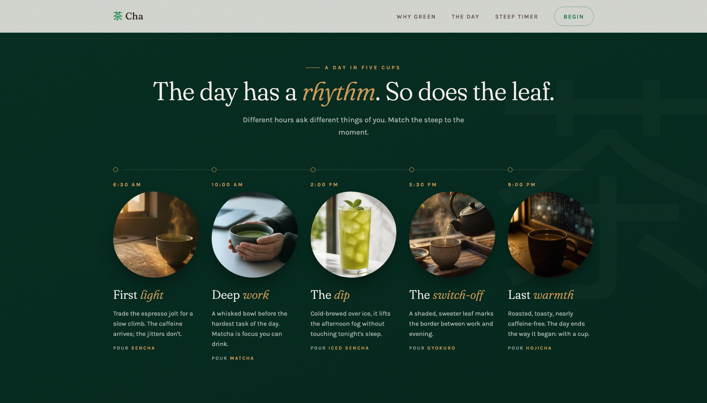

# Cha-Benefits

A green-tea brand prototype testing whether teaching beats selling. It explains each benefit with specifics, maps tea to the time of day, and lets you brew along with a working steep timer.

**Live:** [chabenefits.vercel.app](https://chabenefits.vercel.app/) · [Style guide](https://chabenefits.vercel.app/system)



## Key decisions

- **Teach before asking.** Benefits name the actual compounds (L-theanine, EGCG, catechins), and the email signup is the last section on the page.
- **A timer you can brew with.** Pick a tea and it sets the temperature, dose and time. The cup's colour deepens as it steeps.
- **Restraint as the brand.** One accent colour, slow motion, and none of the usual SaaS patterns like metric tiles or gradient text. Reduced motion gets a full static version, not a stripped one.
- **A style guide that can't drift.** It renders from the site's own CSS, so every colour, type style and component state matches what ships. Building it exposed three different "Title" sizes across the site; they now share one `--title-size` token.

<!--
## Stack

Single HTML file, plain CSS/JS, no build step, no framework. One Vercel
serverless function (`api/subscribe.js`) handles the signup form in
production; `server.js` is a small Node HTTP server used only for local
development (excluded from deployment via `.vercelignore`).
-->

## Structure

```
index.html          Single-page site
css/                 base, nav, hero, benefits, ritual, brew, signup
js/                  hero canvas, grain, nav, marquee, reveal, benefits,
                     brew (steep timer), signup, blob-pause
images/              responsive photography (webp + jpg, srcset)
api/subscribe.js     Vercel Function — signup handler (production)
server.js            Local dev server — signup handler (dev only)
DESIGN.md            Full design system reference
PRODUCT.md           Audience, brand personality, principles
```

## Local development

Requires a `.env` file (two levels up from this folder, matching the
original monorepo layout — adjust the path in `package.json`'s `start`
script if running this repo standalone) with:

```
RESEND_API_KEY=...
NOTIFY_EMAIL=...
```

Then:

```
npm start
```

Serves the site at `http://localhost:3000`. All signups notify
`NOTIFY_EMAIL` rather than the submitted address, since Resend's sandbox
mode (no verified sending domain) only allows delivery to the account's own
address.

## Deployment

Deployed on Vercel as a static site + serverless function
(`"framework": null` in `vercel.json` — required, otherwise Vercel's
zero-config detection picks up `server.js` as a Node server entrypoint
instead of treating this as static + API). Requires `RESEND_API_KEY` and
`NOTIFY_EMAIL` set as Production environment variables on the Vercel
project.

<!--
## Design system

Full token reference, principles, and components: [`DESIGN.md`](./DESIGN.md).
Audience, brand voice, and anti-references: [`PRODUCT.md`](./PRODUCT.md).
A rendered, browsable version of the design system lives at
[cha-design-system.vercel.app](https://cha-design-system.vercel.app/).
-->
